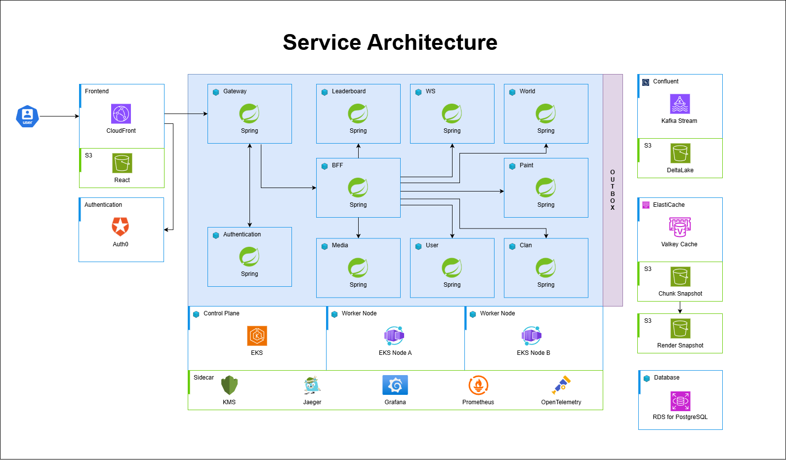

# README (github 업로드 완료)

## 3dPlace

> 3dPlace는 수만 명의 사용자가 동시에 접속해 하나의 3차원 공간을 실시간으로 공유하며,
복셀 기반 작품을 함께 만들어가는 대규모 협업 3D 캔버스 플랫폼입니다.
> 

### 프로젝트 기간

2025. 10. 10 ~ 2025. 11. 20 (총 42일)

### 프로젝트 목표

- 다수의 사용자가 동시에 참여하는 실시간 협업 환경 구현
- 3D 공간에서도 끊김 없는 상호작용 경험 제공

### 아키텍처

본 프로젝트는 기능별 역할 분리와 확장성을 고려하여 Microservice Architecture(MSA) 기반으로 설계되었습니다.
각 서비스는 독립적으로 배포 및 확장이 가능하도록 구성되어, 실시간 트래픽 증가 상황에서도 유연하게 대응할 수 있습니다.

- Frontend
    - 3D 공간 렌더링 및 사용자 입력 처리
    - WebSocket을 통한 실시간 상태 반영
- Backend
    - 비동기 API 서버를 통한 대규모 요청 처리
    - 실시간 이벤트를 안전하게 전달하는 메시지 파이프라인 구성
- Infra
    - AWS EKS(Kubernetes v1.34) 기반으로 마이크로서비스 배포/확장 및 운영 환경 구성
    - Amazon ElastiCache(Valkey Cluster), Amazon RDS(PostgreSQL)기반의 실시간 데이터 처리 및 관리
    - Confluent Cloud Kafka 로 실시간 이벤트 파이프라인 구성(비동기 처리 및 서비스 간 결합도 완화)
    - 장애 격리와 수평 확장 중심으로 실시간 트래픽 상황에서 안정성 확보

### 주요 기능

- 실시간 3D 드로잉
    - 사용자는 3차원 공간에서 복셀을 자유롭게 선택하고 배치할 수 있습니다.
    - 여러 사용자가 동시에 작업하더라도 모든 변경 사항이 실시간으로 반영됩니다.
- 클랜 시스템
    - 공통 목표를 가진 사용자들이 클랜을 구성해 협업할 수 있습니다.
    - 클랜 단위로 활동 기록과 기여도를 관리할 수 있습니다.
- 실시간 랭킹
    - 개인 및 클랜의 활동량을 실시간으로 집계하여 랭킹으로 제공합니다.
    - 경쟁 요소를 통해 지속적인 참여를 유도합니다.

### 주요 기술 및 스택

- Frontend
    - CesiumJS
    - React
    - Zustand
    - Tanstack Query
    - TailwindCSS
- Backend
    - Auth0
    - Spring WebFlux
    - Redis
    - Kafka
    - PostgreSQL
    - JOOQ
- Infra
    - Docker
    - AWS: EKS, EC2(Node), S3, RDS(PostgreSQL), ElastiCache(Valkey Cluster)
    - Kafka: Confluent Cloud
    - Kubernetes: v1.34

### 팀 구성 및 협업 방식

| **역할** | **이름** | **담당업무** |
| --- | --- | --- |
| 팀장 & 프론트엔드 | 최재명 | 페이지 및 전역 상태관리 구조 설계, MSW 기반 프론트엔드 독립 개발환경 세팅, 사용자 조작콘솔 및 커뮤니티 페이지 등 일반 페이지 전반 구현 |
| 프론트엔드 | 정가람 | 메인 페이지 로직 구현 |
| 백엔드 | 김우준 |  MSA 기반 서비스 분리 설계, 도메인별 API 구현 및 서비스 간 통신 구조 설계,  Spring Boot 멀티 모듈 구조 설계, 공통 모듈 구성 및 인증/인가 서비스 구현 |
| 백엔드 | 이재빈 | 대용량 데이터 변환을 위한 서버 파이프라인 설계 및 구현, 비동기 처리 구조 적용과 성능 최적화를 통해 안정적인 데이터 제공 구조 구축 |
| 백엔드 | 이현지 | 비동기 서버 아키텍처 설계 및 기반 구축, 실시간 데이터 파이프라인 최적화 및 브로드캐스팅 구현, 분산 환경 동시성 제어 로직 설계 및 적용 |
| 인프라 | 장민석 | EKS 기반 배포 환경 구축·운영, 서비스 트래픽 라우팅/Ingress 구성, Docker 이미지 빌드·배포 표준화, RDS(PostgreSQL)·ElastiCache(Valkey Cluster)·Confluent Kafka 연동 인프라 구성 |
- GitLab 기반 브랜치 전략 및 코드 리뷰 진행
- Jira를 활용한 이슈 및 스프린트 관리
- API 명세 및 설계 문서를 기반으로 프론트/백엔드 협업